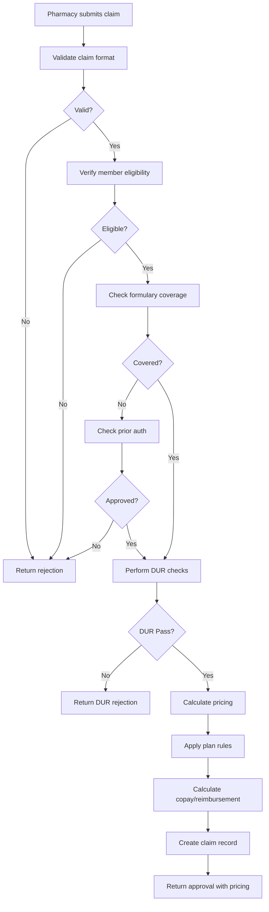
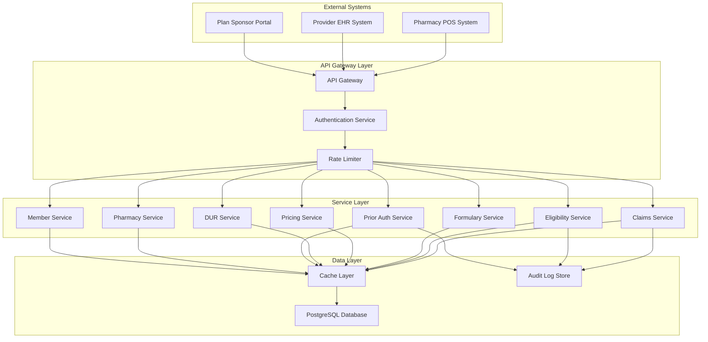
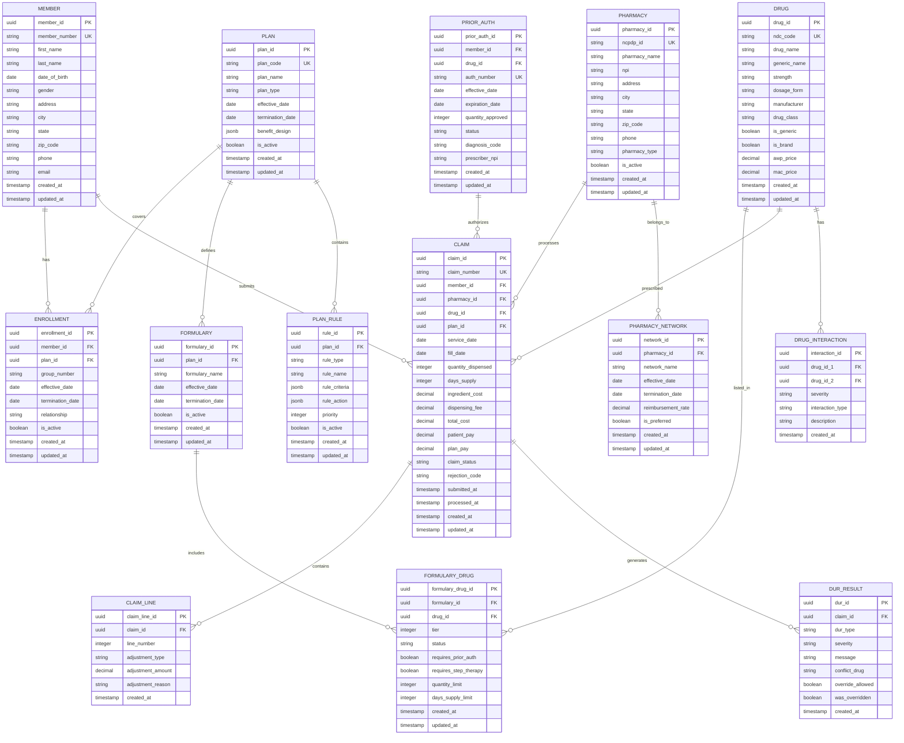
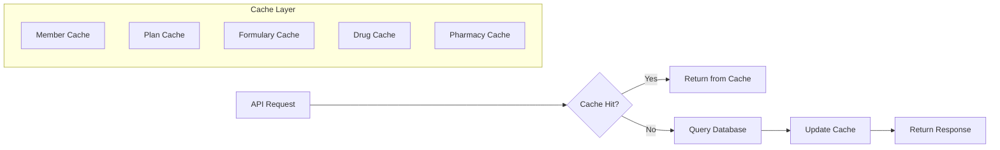
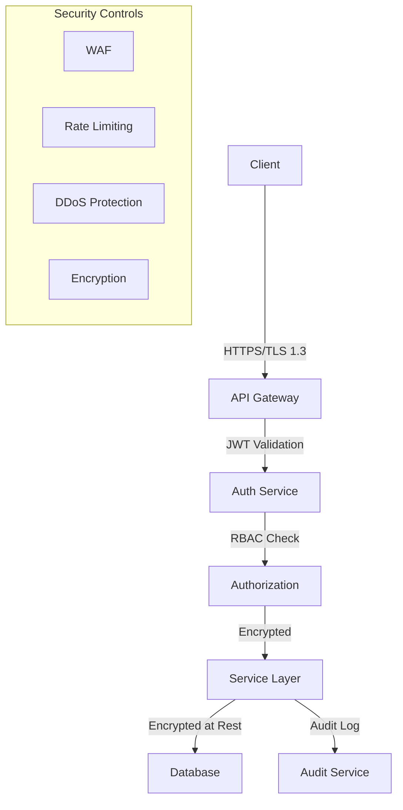

# Pharmacy Benefit Management (PBM)

## Table of Contents
1. [System Architecture](#system-architecture)
   - [System Overview](#system-overview)
   - [Core Business Processes](#core-business-processes)
   - [High-Level Architecture](#high-level-architecture)
   - [Database Design](#database-design)
   - [Service Layer](#service-layer)
   - [API Specifications](#api-specifications)
   - [Performance & Caching Strategy](#performance--caching-strategy)
   - [Security & Compliance](#security--compliance)
2. [Implementation](#implementation)

---

## System Architecture

### System Overview

The Pharmacy Benefit Management (PBM) system is designed to process prescription drug claims in real-time for the US healthcare market. The system manages the complete lifecycle of pharmacy benefits including member eligibility, formulary management, claims adjudication, pricing calculations, and pharmacy network management.

### Key Features
- **Real-time Claims Adjudication**: Process pharmacy claims in milliseconds
- **Member Eligibility Verification**: Validate member coverage and benefits
- **Formulary Management**: Manage drug coverage, tiers, and restrictions
- **Pricing & Reimbursement**: Calculate patient copays and pharmacy reimbursements
- **Drug Utilization Review (DUR)**: Clinical safety checks and drug interactions
- **Prior Authorization**: Workflow management for restricted medications
- **Pharmacy Network Management**: Maintain pharmacy contracts and networks

### Technology Stack
- **Backend**: Java-based microservices
- **Database**: PostgreSQL for persistent storage
- **Caching Layer**: Pluggable in-memory solution (Apache Ignite, Redis, Hazelcast)
- **API**: RESTful services with JSON payloads
- **Future**: NCPDP standards compliance layer

---

### Core Business Processes

#### 1. Claims Adjudication Workflow

The claims adjudication process is the heart of the PBM system:



#### 2. Key Business Entities

- **Member**: Individual covered under a health plan
- **Plan**: Benefit design with coverage rules and cost-sharing
- **Pharmacy**: Retail or mail-order pharmacy in the network
- **Drug**: Medication with NDC code, pricing, and clinical data
- **Formulary**: List of covered drugs with tier assignments
- **Claim**: Transaction record of a prescription fill
- **Prior Authorization**: Approval workflow for restricted drugs

---

### High-Level Architecture



### Microservices Architecture

The system follows a microservices pattern with the following services:

1. **Claims Adjudication Service**: Core claim processing engine
2. **Eligibility Service**: Member coverage verification
3. **Formulary Service**: Drug coverage and tier management
4. **Pricing Service**: Cost calculation engine
5. **DUR Service**: Clinical safety checks
6. **Prior Authorization Service**: Approval workflow management
7. **Pharmacy Service**: Network and pharmacy data management
8. **Member Service**: Member demographics and enrollment
9. **Plan Service**: Benefit plan configuration
10. **Audit Service**: Transaction logging and compliance

---

### Database Design

#### Entity Relationship Diagram



### Key Database Tables

#### Core Tables

**MEMBER**: Stores member demographic information
- Primary identifier: `member_id` (UUID)
- Unique business key: `member_number`
- Includes personal information and contact details

**PLAN**: Defines benefit plan configurations
- Primary identifier: `plan_id` (UUID)
- Stores benefit design in JSONB for flexibility
- Supports date-based plan versions

**ENROLLMENT**: Links members to plans
- Manages member-plan relationships
- Supports multiple enrollments per member
- Tracks effective and termination dates

**DRUG**: Master drug database
- NDC (National Drug Code) as unique identifier
- Includes pricing information (AWP, MAC)
- Supports both brand and generic drugs

**CLAIM**: Transaction records
- Captures all claim details
- Stores pricing breakdown
- Tracks claim status and processing timestamps

#### Supporting Tables

**FORMULARY**: Drug coverage lists per plan
**FORMULARY_DRUG**: Drug-specific coverage rules
**PHARMACY**: Pharmacy network directory
**PRIOR_AUTH**: Authorization records
**DUR_RESULT**: Clinical safety check results
**PLAN_RULE**: Configurable business rules

### Indexing Strategy

```sql
-- High-performance indexes for common queries
CREATE INDEX idx_member_number ON member(member_number);
CREATE INDEX idx_enrollment_member_active ON enrollment(member_id, is_active);
CREATE INDEX idx_claim_member_date ON claim(member_id, service_date DESC);
CREATE INDEX idx_claim_status ON claim(claim_status, submitted_at);
CREATE INDEX idx_drug_ndc ON drug(ndc_code);
CREATE INDEX idx_formulary_drug_lookup ON formulary_drug(formulary_id, drug_id);
CREATE INDEX idx_pharmacy_ncpdp ON pharmacy(ncpdp_id);
CREATE INDEX idx_prior_auth_member ON prior_auth(member_id, status, expiration_date);

-- Composite indexes for complex queries
CREATE INDEX idx_enrollment_active_dates ON enrollment(member_id, is_active, effective_date, termination_date);
CREATE INDEX idx_claim_processing ON claim(claim_status, submitted_at) WHERE claim_status = 'PENDING';
```

---

### Service Layer

#### 1. Claims Adjudication Service

**Responsibility**: Process pharmacy claims in real-time

**Core Operations**:
- Validate claim data
- Orchestrate eligibility, formulary, and DUR checks
- Calculate pricing and cost-sharing
- Generate claim response

**Key Methods**:
```java
ClaimResponse adjudicateClaim(ClaimRequest request)
ClaimResponse reverseClaim(String claimNumber)
ClaimResponse rebillClaim(String claimNumber, ClaimRequest updates)
List<Claim> getClaimHistory(String memberId, LocalDate startDate, LocalDate endDate)
```

**Business Logic**:
- Real-time processing with <500ms response time
- Atomic transaction handling
- Comprehensive validation rules
- Rejection code mapping

#### 2. Eligibility Service

**Responsibility**: Verify member coverage and benefits

**Core Operations**:
- Check member enrollment status
- Validate coverage dates
- Retrieve benefit details
- Check accumulator balances

**Key Methods**:
```java
EligibilityResponse checkEligibility(String memberId, LocalDate serviceDate)
BenefitDetails getBenefitDetails(String memberId, String planId)
AccumulatorStatus getAccumulators(String memberId, String planId)
```

**Business Logic**:
- Date-based eligibility validation
- Multi-plan support
- Real-time accumulator tracking
- Coordination of benefits (COB)

#### 3. Formulary Service

**Responsibility**: Manage drug coverage and restrictions

**Core Operations**:
- Check drug coverage status
- Retrieve tier information
- Validate quantity limits
- Check prior authorization requirements

**Key Methods**:
```java
FormularyStatus checkCoverage(String planId, String ndcCode)
List<FormularyDrug> searchFormulary(String planId, String searchTerm)
List<Alternative> getAlternatives(String ndcCode, String planId)
```

**Business Logic**:
- Tier-based coverage
- Step therapy protocols
- Quantity and day supply limits
- Therapeutic alternatives

#### 4. Pricing Service

**Responsibility**: Calculate costs and reimbursements

**Core Operations**:
- Calculate ingredient cost
- Apply pricing formulas (AWP, MAC, etc.)
- Calculate patient copay/coinsurance
- Determine pharmacy reimbursement

**Key Methods**:
```java
PricingResult calculatePricing(PricingRequest request)
CopayAmount calculateCopay(String planId, String ndcCode, int tier)
ReimbursementAmount calculateReimbursement(String pharmacyId, String ndcCode)
```

**Business Logic**:
- Multiple pricing methodologies
- Tier-based cost sharing
- Deductible and out-of-pocket max tracking
- Network-based reimbursement rates

#### 5. Drug Utilization Review (DUR) Service

**Responsibility**: Perform clinical safety checks

**Core Operations**:
- Check drug-drug interactions
- Validate therapeutic duplication
- Check age/gender appropriateness
- Verify dosage limits

**Key Methods**:
```java
List<DURResult> performDUR(DURRequest request)
List<Interaction> checkInteractions(String ndcCode, List<String> currentMedications)
boolean validateDosage(String ndcCode, int quantity, int daysSupply)
```

**Business Logic**:
- Real-time interaction checking
- Severity-based alerts
- Override capabilities
- Clinical rule engine

#### 6. Prior Authorization Service

**Responsibility**: Manage approval workflows

**Core Operations**:
- Submit authorization requests
- Check authorization status
- Approve/deny requests
- Track authorization usage

**Key Methods**:
```java
PriorAuth submitRequest(PriorAuthRequest request)
PriorAuthStatus checkStatus(String authNumber)
PriorAuth approveRequest(String authNumber, ApprovalDetails details)
boolean validateAuthorization(String memberId, String ndcCode, LocalDate serviceDate)
```

**Business Logic**:
- Workflow state management
- Expiration tracking
- Quantity tracking
- Clinical criteria evaluation

#### 7. Pharmacy Service

**Responsibility**: Manage pharmacy network data

**Core Operations**:
- Maintain pharmacy directory
- Manage network assignments
- Track pharmacy contracts
- Validate pharmacy credentials

**Key Methods**:
```java
Pharmacy getPharmacy(String ncpdpId)
List<Pharmacy> searchPharmacies(PharmacySearchCriteria criteria)
NetworkStatus checkNetworkStatus(String pharmacyId, String networkId)
```

#### 8. Member Service

**Responsibility**: Manage member information

**Core Operations**:
- Maintain member demographics
- Manage enrollments
- Track member history
- Handle member updates

**Key Methods**:
```java
Member getMember(String memberId)
List<Enrollment> getEnrollments(String memberId)
Member updateMember(String memberId, MemberUpdate update)
```

---

### API Specifications

#### REST API Design Principles

- RESTful resource-based URLs
- JSON request/response format
- HTTP status codes for responses
- Versioned APIs (v1, v2, etc.)
- Pagination for list endpoints
- Filtering and sorting support

#### Authentication & Authorization

```
Authorization: Bearer <JWT_TOKEN>
X-API-Key: <API_KEY>
```

#### Common Response Structure

```json
{
  "status": "success|error",
  "timestamp": "2024-01-15T10:30:00Z",
  "data": {},
  "errors": [],
  "metadata": {
    "requestId": "uuid",
    "processingTime": 125
  }
}
```

#### 1. Claims API

##### Submit Claim
```
POST /api/v1/claims
Content-Type: application/json

Request:
{
  "claimNumber": "CLM20240115001",
  "memberId": "M123456",
  "pharmacyId": "PHM001",
  "serviceDate": "2024-01-15",
  "prescription": {
    "ndcCode": "00002-1234-01",
    "quantity": 30,
    "daysSupply": 30,
    "refillNumber": 0,
    "prescriberId": "NPI1234567890"
  },
  "pricing": {
    "ingredientCost": 125.50,
    "dispensingFee": 2.50
  }
}

Response (200 OK):
{
  "status": "success",
  "timestamp": "2024-01-15T10:30:00Z",
  "data": {
    "claimId": "uuid",
    "claimNumber": "CLM20240115001",
    "claimStatus": "APPROVED",
    "authorizationNumber": "AUTH123456",
    "pricing": {
      "totalCost": 128.00,
      "patientPay": 10.00,
      "planPay": 118.00,
      "copayType": "FLAT"
    },
    "durResults": [],
    "messages": [
      {
        "code": "INFO001",
        "message": "Claim processed successfully"
      }
    ]
  },
  "metadata": {
    "requestId": "uuid",
    "processingTime": 245
  }
}

Response (400 Bad Request - Rejection):
{
  "status": "error",
  "timestamp": "2024-01-15T10:30:00Z",
  "errors": [
    {
      "code": "REJECT_75",
      "message": "Prior authorization required",
      "field": "prescription.ndcCode"
    }
  ],
  "metadata": {
    "requestId": "uuid",
    "processingTime": 180
  }
}
```

##### Reverse Claim
```
POST /api/v1/claims/{claimNumber}/reverse
Content-Type: application/json

Request:
{
  "reversalReason": "DISPENSING_ERROR"
}

Response (200 OK):
{
  "status": "success",
  "data": {
    "claimId": "uuid",
    "claimNumber": "CLM20240115001",
    "claimStatus": "REVERSED",
    "reversalDate": "2024-01-15T11:00:00Z"
  }
}
```

##### Get Claim History
```
GET /api/v1/claims?memberId=M123456&startDate=2024-01-01&endDate=2024-01-31&page=1&size=20

Response (200 OK):
{
  "status": "success",
  "data": {
    "claims": [
      {
        "claimId": "uuid",
        "claimNumber": "CLM20240115001",
        "serviceDate": "2024-01-15",
        "drugName": "Lisinopril 10mg",
        "quantity": 30,
        "totalCost": 128.00,
        "patientPay": 10.00,
        "claimStatus": "APPROVED"
      }
    ],
    "pagination": {
      "page": 1,
      "size": 20,
      "totalElements": 45,
      "totalPages": 3
    }
  }
}
```

#### 2. Eligibility API

##### Check Eligibility
```
POST /api/v1/eligibility/check
Content-Type: application/json

Request:
{
  "memberId": "M123456",
  "serviceDate": "2024-01-15"
}

Response (200 OK):
{
  "status": "success",
  "data": {
    "memberId": "M123456",
    "memberName": "John Doe",
    "isEligible": true,
    "plan": {
      "planId": "PLN001",
      "planName": "Gold Plan",
      "effectiveDate": "2024-01-01",
      "terminationDate": "2024-12-31"
    },
    "benefits": {
      "deductible": {
        "amount": 500.00,
        "met": 150.00,
        "remaining": 350.00
      },
      "outOfPocketMax": {
        "amount": 2000.00,
        "met": 450.00,
        "remaining": 1550.00
      }
    }
  }
}
```

#### 3. Formulary API

##### Check Drug Coverage
```
GET /api/v1/formulary/coverage?planId=PLN001&ndcCode=00002-1234-01

Response (200 OK):
{
  "status": "success",
  "data": {
    "isCovered": true,
    "tier": 2,
    "status": "PREFERRED",
    "restrictions": {
      "requiresPriorAuth": false,
      "requiresStepTherapy": false,
      "quantityLimit": 30,
      "daysSupplyLimit": 30
    },
    "costSharing": {
      "copay": 10.00,
      "coinsurance": null
    }
  }
}
```

##### Search Formulary
```
GET /api/v1/formulary/search?planId=PLN001&query=lisinopril&page=1&size=20

Response (200 OK):
{
  "status": "success",
  "data": {
    "drugs": [
      {
        "ndcCode": "00002-1234-01",
        "drugName": "Lisinopril 10mg Tablet",
        "genericName": "Lisinopril",
        "tier": 1,
        "isGeneric": true,
        "copay": 5.00
      }
    ],
    "pagination": {
      "page": 1,
      "size": 20,
      "totalElements": 8,
      "totalPages": 1
    }
  }
}
```

#### 4. Prior Authorization API

##### Submit Prior Auth Request
```
POST /api/v1/prior-auth
Content-Type: application/json

Request:
{
  "memberId": "M123456",
  "ndcCode": "00002-5678-01",
  "quantity": 30,
  "daysSupply": 30,
  "diagnosisCode": "I10",
  "prescriberId": "NPI1234567890",
  "clinicalJustification": "Patient has tried and failed two other medications"
}

Response (201 Created):
{
  "status": "success",
  "data": {
    "priorAuthId": "uuid",
    "authNumber": "PA20240115001",
    "status": "PENDING",
    "submittedDate": "2024-01-15T10:30:00Z",
    "expectedDecisionDate": "2024-01-17T23:59:59Z"
  }
}
```

##### Check Prior Auth Status
```
GET /api/v1/prior-auth/{authNumber}

Response (200 OK):
{
  "status": "success",
  "data": {
    "priorAuthId": "uuid",
    "authNumber": "PA20240115001",
    "status": "APPROVED",
    "effectiveDate": "2024-01-16",
    "expirationDate": "2024-07-16",
    "quantityApproved": 30,
    "approvedBy": "Clinical Pharmacist",
    "approvalDate": "2024-01-16T14:30:00Z"
  }
}
```

#### 5. Pharmacy API

##### Get Pharmacy Details
```
GET /api/v1/pharmacies/{ncpdpId}

Response (200 OK):
{
  "status": "success",
  "data": {
    "pharmacyId": "uuid",
    "ncpdpId": "1234567",
    "pharmacyName": "Main Street Pharmacy",
    "npi": "1234567890",
    "address": {
      "street": "123 Main St",
      "city": "Springfield",
      "state": "IL",
      "zipCode": "62701"
    },
    "phone": "217-555-0100",
    "pharmacyType": "RETAIL",
    "networks": [
      {
        "networkId": "NET001",
        "networkName": "Preferred Network",
        "isPreferred": true
      }
    ]
  }
}
```

##### Search Pharmacies
```
GET /api/v1/pharmacies/search?zipCode=62701&radius=10&networkId=NET001

Response (200 OK):
{
  "status": "success",
  "data": {
    "pharmacies": [
      {
        "pharmacyId": "uuid",
        "ncpdpId": "1234567",
        "pharmacyName": "Main Street Pharmacy",
        "address": "123 Main St, Springfield, IL 62701",
        "distance": 2.5,
        "isPreferred": true,
        "phone": "217-555-0100"
      }
    ]
  }
}
```

#### 6. Member API

##### Get Member Details
```
GET /api/v1/members/{memberId}

Response (200 OK):
{
  "status": "success",
  "data": {
    "memberId": "uuid",
    "memberNumber": "M123456",
    "firstName": "John",
    "lastName": "Doe",
    "dateOfBirth": "1980-05-15",
    "gender": "M",
    "contact": {
      "address": "456 Oak Ave",
      "city": "Springfield",
      "state": "IL",
      "zipCode": "62701",
      "phone": "217-555-0200",
      "email": "john.doe@email.com"
    },
    "enrollments": [
      {
        "enrollmentId": "uuid",
        "planId": "PLN001",
        "planName": "Gold Plan",
        "effectiveDate": "2024-01-01",
        "terminationDate": "2024-12-31",
        "isActive": true
      }
    ]
  }
}
```

#### API Error Codes

| Code | Description |
|------|-------------|
| REJECT_01 | Member not found |
| REJECT_02 | Member not eligible |
| REJECT_03 | Plan not active |
| REJECT_04 | Drug not covered |
| REJECT_05 | Quantity limit exceeded |
| REJECT_06 | Days supply limit exceeded |
| REJECT_75 | Prior authorization required |
| REJECT_76 | Step therapy required |
| REJECT_88 | DUR rejection |
| REJECT_99 | System error |

---

### Performance & Caching Strategy

#### Performance Requirements

- **Claims Processing**: <500ms response time (95th percentile)
- **Eligibility Check**: <100ms response time
- **Formulary Lookup**: <50ms response time
- **Throughput**: 10,000+ claims per minute
- **Availability**: 99.9% uptime

#### Caching Architecture



#### Cache Strategy by Entity

##### 1. Member Data
- **Cache Duration**: 15 minutes
- **Invalidation**: On member update
- **Key Pattern**: `member:{memberId}`
- **Rationale**: Moderate change frequency, high read volume

##### 2. Plan & Formulary Data
- **Cache Duration**: 1 hour
- **Invalidation**: On plan/formulary update
- **Key Pattern**: `plan:{planId}`, `formulary:{planId}:{ndcCode}`
- **Rationale**: Low change frequency, very high read volume

##### 3. Drug Master Data
- **Cache Duration**: 24 hours
- **Invalidation**: On drug update
- **Key Pattern**: `drug:{ndcCode}`
- **Rationale**: Very low change frequency, high read volume

##### 4. Pharmacy Data
- **Cache Duration**: 1 hour
- **Invalidation**: On pharmacy update
- **Key Pattern**: `pharmacy:{ncpdpId}`
- **Rationale**: Low change frequency, moderate read volume

##### 5. Prior Authorization Status
- **Cache Duration**: 5 minutes
- **Invalidation**: On status change
- **Key Pattern**: `prior-auth:{authNumber}`
- **Rationale**: Moderate change frequency, high read volume during claim processing

#### Cache Implementation Options

##### Option 1: Apache Ignite
```java
// Distributed cache with SQL capabilities
IgniteCache<String, Member> memberCache = ignite.cache("memberCache");
memberCache.put(memberId, member);
Member cachedMember = memberCache.get(memberId);
```

**Pros**:
- SQL queries on cached data
- Distributed computing capabilities
- ACID transactions
- Persistence options

**Cons**:
- Higher memory footprint
- More complex setup

##### Option 2: Redis
```java
// Simple key-value cache
redisTemplate.opsForValue().set("member:" + memberId, member, 15, TimeUnit.MINUTES);
Member cachedMember = redisTemplate.opsForValue().get("member:" + memberId);
```

**Pros**:
- Simple and fast
- Rich data structures
- Pub/sub capabilities
- Wide adoption

**Cons**:
- Limited query capabilities
- Single-threaded per instance

##### Option 3: Hazelcast
```java
// In-memory data grid
HazelcastInstance hz = Hazelcast.newHazelcastInstance();
IMap<String, Member> memberMap = hz.getMap("members");
memberMap.put(memberId, member);
```

**Pros**:
- Easy clustering
- Good Java integration
- Distributed collections
- WAN replication

**Cons**:
- Less feature-rich than Ignite
- Smaller community

#### Database Optimization

##### Connection Pooling
```java
// HikariCP configuration
HikariConfig config = new HikariConfig();
config.setMaximumPoolSize(50);
config.setMinimumIdle(10);
config.setConnectionTimeout(30000);
config.setIdleTimeout(600000);
config.setMaxLifetime(1800000);
```

##### Read Replicas
- Master for writes
- Read replicas for queries
- Load balancing across replicas

##### Partitioning Strategy
- Partition claims by date (monthly partitions)
- Partition audit logs by date (daily partitions)
- Improves query performance and maintenance

```sql
-- Example: Partitioned claims table
CREATE TABLE claim (
    claim_id UUID,
    service_date DATE,
    ...
) PARTITION BY RANGE (service_date);

CREATE TABLE claim_2024_01 PARTITION OF claim
    FOR VALUES FROM ('2024-01-01') TO ('2024-02-01');
```

#### Monitoring & Metrics

Key metrics to track:
- Cache hit ratio (target: >90%)
- Average response time per endpoint
- Database query execution time
- Connection pool utilization
- Error rates by type
- Throughput (requests per second)

---

### Security & Compliance

#### Security Architecture



#### Authentication & Authorization

##### JWT Token Structure
```json
{
  "sub": "user@example.com",
  "iss": "pbm-auth-service",
  "aud": "pbm-api",
  "exp": 1705334400,
  "iat": 1705330800,
  "roles": ["PHARMACY", "CLAIMS_PROCESSOR"],
  "permissions": [
    "claims:submit",
    "claims:reverse",
    "eligibility:check"
  ],
  "pharmacyId": "PHM001"
}
```

##### Role-Based Access Control (RBAC)

| Role | Permissions |
|------|-------------|
| PHARMACY | Submit claims, check eligibility, search formulary |
| CLAIMS_PROCESSOR | View claims, process reversals, run reports |
| CLINICAL_PHARMACIST | Review prior auths, override DUR, view clinical data |
| PLAN_ADMIN | Manage plans, formularies, configure rules |
| SYSTEM_ADMIN | Full access, user management, system configuration |

#### Data Protection

##### Encryption at Rest
- Database: AES-256 encryption
- Backups: Encrypted with separate keys
- File storage: Server-side encryption

##### Encryption in Transit
- TLS 1.3 for all API communications
- Certificate pinning for mobile apps
- Mutual TLS for service-to-service communication

##### PHI/PII Protection
- Tokenization of sensitive data
- Field-level encryption for SSN, DOB
- Masking in logs and error messages
- Data retention policies

#### HIPAA Compliance

##### Required Controls

1. **Access Controls**
   - Unique user identification
   - Emergency access procedures
   - Automatic logoff
   - Encryption and decryption

2. **Audit Controls**
   - Log all PHI access
   - Track user activities
   - Tamper-proof audit logs
   - Regular audit reviews

3. **Integrity Controls**
   - Data validation
   - Error correction
   - Checksums for data transmission

4. **Transmission Security**
   - Encryption in transit
   - Integrity controls
   - Network security

##### Audit Logging

All PHI access must be logged:
```json
{
  "timestamp": "2024-01-15T10:30:00Z",
  "userId": "user@example.com",
  "action": "READ",
  "resource": "member",
  "resourceId": "M123456",
  "ipAddress": "192.168.1.100",
  "userAgent": "PBM-API-Client/1.0",
  "result": "SUCCESS",
  "phi_accessed": ["name", "dob", "address"]
}
```

#### API Security

##### Rate Limiting
```
X-RateLimit-Limit: 1000
X-RateLimit-Remaining: 999
X-RateLimit-Reset: 1705334400
```

- Per API key: 1000 requests/minute
- Per IP: 100 requests/minute
- Burst allowance: 150% of limit for 10 seconds

##### Input Validation
- Schema validation for all requests
- SQL injection prevention
- XSS protection
- Command injection prevention

##### API Key Management
- Rotation every 90 days
- Separate keys for dev/test/prod
- Key revocation capability
- Usage tracking per key

#### Disaster Recovery

##### Backup Strategy
- Database: Daily full backup, hourly incremental
- Retention: 30 days online, 7 years archived
- Geographic redundancy: Multi-region backups
- Recovery Time Objective (RTO): 4 hours
- Recovery Point Objective (RPO): 1 hour

##### High Availability
- Multi-AZ deployment
- Active-active database replication
- Automatic failover
- Health checks and monitoring

---

## Implementation

### Roadmap

#### Phase 1: Foundation (Months 1-2)
- [ ] Set up development environment
- [ ] Create database schema
- [ ] Implement core data models
- [ ] Set up CI/CD pipeline
- [ ] Implement authentication service

#### Phase 2: Core Services (Months 3-4)
- [ ] Implement Member Service
- [ ] Implement Plan Service
- [ ] Implement Formulary Service
- [ ] Implement Pharmacy Service
- [ ] Set up caching layer

#### Phase 3: Claims Processing (Months 5-6)
- [ ] Implement Eligibility Service
- [ ] Implement Pricing Service
- [ ] Implement DUR Service
- [ ] Implement Claims Adjudication Service
- [ ] Integration testing

#### Phase 4: Advanced Features (Months 7-8)
- [ ] Implement Prior Authorization Service
- [ ] Implement reporting capabilities
- [ ] Implement audit logging
- [ ] Performance optimization
- [ ] Security hardening

#### Phase 5: Standards & Integration (Months 9-10)
- [ ] NCPDP D.0 compliance layer
- [ ] External system integrations
- [ ] Load testing
- [ ] User acceptance testing
- [ ] Documentation completion


## Apache Ignite vs PostgreSQL Performance Comparison

This project also includes performance benchmarking between Apache Ignite (in-memory data grid) and PostgreSQL for PBM workloads. See the [IgniteVSPostgres](./IgniteVSPostgres/) directory for implementation details.

#### Use Cases for Each Technology

**Apache Ignite**:
- Real-time claims adjudication (sub-100ms response)
- High-frequency eligibility checks
- Formulary lookups during claim processing
- Session state management
- Distributed computing for analytics

**PostgreSQL**:
- Persistent storage for all entities
- Complex reporting queries
- Historical data analysis
- Audit trail storage
- Batch processing jobs

**Hybrid Approach** (Recommended):
- PostgreSQL as system of record
- Ignite for hot data caching and real-time processing
- Write-through cache pattern for consistency
- Periodic cache refresh from PostgreSQL


## Appendix

### Glossary

- **AWP**: Average Wholesale Price - benchmark drug pricing
- **MAC**: Maximum Allowable Cost - generic drug pricing limit
- **NDC**: National Drug Code - unique drug identifier
- **NCPDP**: National Council for Prescription Drug Programs - standards organization
- **DUR**: Drug Utilization Review - clinical safety checks
- **PBM**: Pharmacy Benefit Manager - manages prescription drug benefits
- **PHI**: Protected Health Information - HIPAA-protected data
- **Prior Authorization**: Pre-approval required for certain medications
- **Formulary**: List of covered drugs with tier assignments
- **Adjudication**: Process of evaluating and pricing a claim

### References

- NCPDP Standards: https://www.ncpdp.org/
- HIPAA Regulations: https://www.hhs.gov/hipaa/
- FDA NDC Directory: https://www.fda.gov/drugs/drug-approvals-and-databases/national-drug-code-directory

